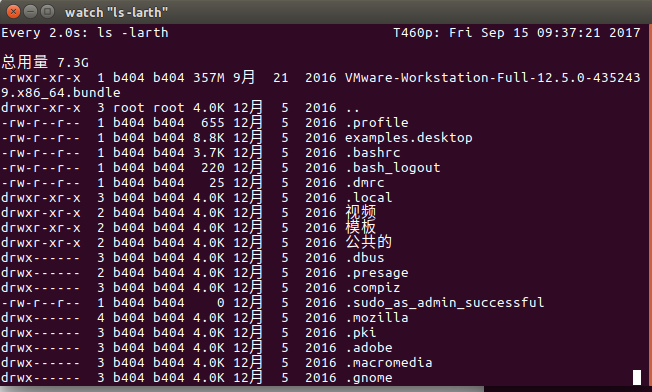
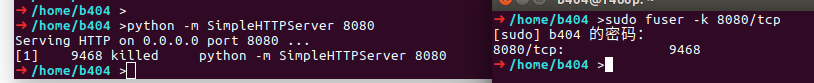
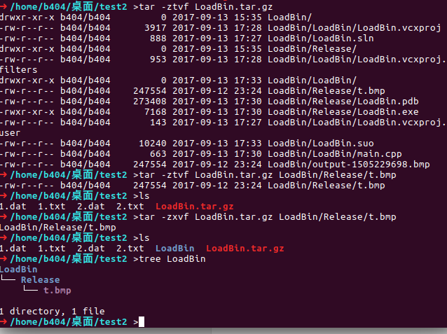
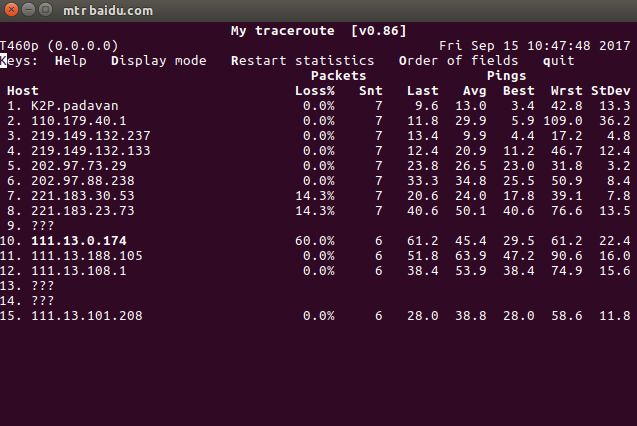
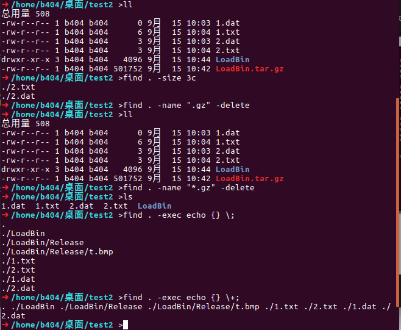
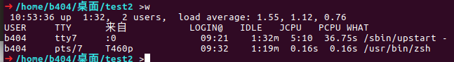
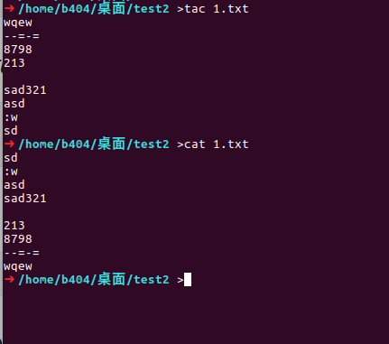
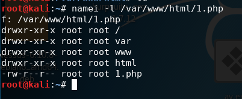
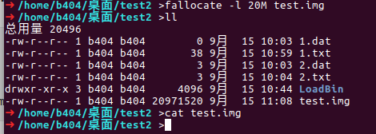
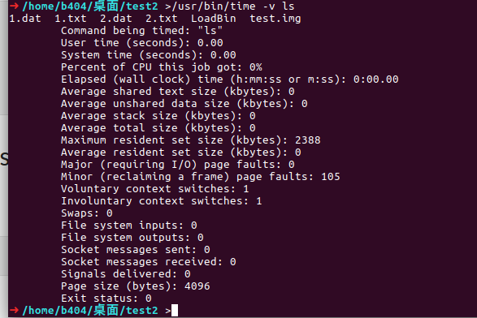

# Linux Commands


## Linux的文件和目录

现代操作系统为解决信息能独立于进程之外被长期存储引入了文件，文件作为进程创建信息的逻辑单元可被多个进程并发使用。在 UNIX 系统中，操作系统为磁盘上的文本与图像、鼠标与键盘等输入设备及网络交互等 I/O 操作设计了一组通用 API，使他们被处理时均可统一使用字节流方式。换言之，UNIX 系统中除进程之外的一切皆是文件，而 Linux 保持了这一特性。为了便于文件的管理，Linux 还引入了目录（有时亦被称为文件夹）这一概念。目录使文件可被分类管理，且目录的引入使 Linux 的文件系统形成一个层级结构的目录树。清单 1.所示的是普通 Linux 系统的顶层目录结构，其中 /dev 是存放了设备相关文件的目录。

```css
/ 虚拟目录的根目录。通常不会在这里存储文件
/bin 二进制目录,存放许多用户级的GNU工具
/boot 启动目录,存放启动文件
/dev 设备目录,Linux在这里创建设备节点
/etc 系统配置文件目录
/home 主目录,Linux在这里创建用户目录
/lib 库目录,存放系统和应用程序的库文件
/media 媒体目录,可移动媒体设备的常用挂载点
/mnt 挂载目录,另一个可移动媒体设备的常用挂载点
/opt 可选目录,常用于存放第三方软件包和数据文件
/proc 进程目录,存放现有硬件及当前进程的相关信息
/root root用户的主目录
/sbin 系统二进制目录,存放许多GNU管理员级工具
/run 运行目录,存放系统运作时的运行时数据
/srv 服务目录,存放本地服务的相关文件
/sys 系统目录,存放系统硬件信息的相关文件
/tmp 临时目录,可以在该目录中创建和删除临时工作文件
/usr 用户二进制目录,大量用户级的GNU工具和数据文件都存
```

`.`单点符表示当前工作目录


## Linux 的硬链接与软链接

硬链接与软链接是 Linux 文件系统中的一个重要概念，其涉及文件系统中的索引节点 (index node 又称 inode)，而索引节点对象是 Linux 虚拟文件系统 (VFS) 的四个基本概念之一。通过剖析硬链接与软链接的联系与区别，我们可更好的了解 Linux 中 VFS 这一通用文件模型。并让 Linux 普通用户和系统管理员正确使用硬链接与软链接，帮助文件系统开发者获取 inode 的相关知识。

**见 [Linux的硬链接和软链接](https://www.ibm.com/developerworks/cn/linux/l-cn-hardandsymb-links/index.html):https://www.ibm.com/developerworks/cn/linux/l-cn-hardandsymb-links/index.html**

linux中的文件链接：

- 符号链接：真实存在的文件
- 硬链接

要为一个文件创建符号链接，原始文件必须事先存在。可以使用`ln -s`选项创建符号链接。

可以使用`ls -i`查阅inode编号，证明不是同一个文件。

```javascript
➜ /home/b404/桌面/test >ls
1  1.txt  2  3  4  test
➜ /home/b404/桌面/test >ln -s 1.txt ls_1
➜ /home/b404/桌面/test >ls -l *1
-rw-r--r-- 1 b404 b404 0 8月  22 16:56 1
lrwxrwxrwx 1 b404 b404 5 8月  22 17:04 ls_1 -> 1.txt
➜ /home/b404/桌面/test >ls -i *1
7887805 1  7887810 ls_1
➜ /home/b404/桌面/test >
```

> 使用 ls -li 命令显示了 * code_files的inode编号以及长列表。注意,带有硬链接的文件共享inode编号。这是因为它们终归是同一个文件。还要注意的是,链接计数(列表中第三项)显示这两个文件都有两个链接。另外,它们的文件大小也一模一样。

**只能对处于同一存储媒体的文件创建硬链接。要想在不同存储媒体的文件之间创建链接,只能使用符号链接。**

## 重命名文件

在Linux中,重命名文件称为移动(moving)。 mv 命令可以将文件和目录移动到另一个位置或重新命名。
注意,移动文件会将文件名从fall更改为fzll,但inode编号和时间戳保持不变。这是因为 mv只影响文件名。

```css
➜ /home/b404/桌面/test >ls -li
总用量 8
7887805 -rw-r--r-- 1 b404 b404    0 8月  22 16:56 1
7887811 -rw-r--r-- 1 b404 b404    4 8月  22 17:02 1.txt
7887806 -rw-r--r-- 1 b404 b404    0 8月  22 16:56 2
7887808 -rw-r--r-- 1 b404 b404    0 8月  22 16:56 3
7887809 -rw-r--r-- 1 b404 b404    0 8月  22 16:56 4
7887810 lrwxrwxrwx 1 b404 b404    5 8月  22 17:04 ls_1 -> 1.txt
7887807 drwxr-xr-x 2 b404 b404 4096 8月  22 16:56 test
➜ /home/b404/桌面/test >mv 2 22
➜ /home/b404/桌面/test >ls -li
总用量 8
7887805 -rw-r--r-- 1 b404 b404    0 8月  22 16:56 1
7887811 -rw-r--r-- 1 b404 b404    4 8月  22 17:02 1.txt
7887806 -rw-r--r-- 1 b404 b404    0 8月  22 16:56 22
7887808 -rw-r--r-- 1 b404 b404    0 8月  22 16:56 3
7887809 -rw-r--r-- 1 b404 b404    0 8月  22 16:56 4
7887810 lrwxrwxrwx 1 b404 b404    5 8月  22 17:04 ls_1 -> 1.txt
7887807 drwxr-xr-x 2 b404 b404 4096 8月  22 16:56 test
➜ /home/b404/桌面/test >
```


## 删除文件

迟早有一天,你得删除已有的文件。不管是清理文件系统还是删除某个软件包,总有要删除文件的时候。
在Linux中,删除(deleting)叫作移除(removing) 1 。bash shell中删除文件的命令是 rm 。 rm命令的基本格式非常简单。

```css
➜ /home/b404/桌面/test >rm -i 1
rm：是否删除普通空文件 '1'？ y
➜ /home/b404/桌面/test >ls
1.txt  22  3  4  ls_1  test
➜ /home/b404/桌面/test >
```

多使用`-i`提示


rm 命令的另外一个特性是,如果要删除很多文件且不受提示符的打扰,可以用 -f 参数强制删除。

## 创建目录

在Linux中创建目录很简单,用 mkdir 命令即可

## 删除目录

删除目录的基本命令是 rmdir 。

```css
➜ /home/b404/桌面/test >ls
0  1.txt  22  3  4  ls_1  test
➜ /home/b404/桌面/test >rmdir 0
rmdir: 删除 '0' 失败: 目录非空
➜ /home/b404/桌面/test >cd 0
➜ /home/b404/桌面/test/0 >ls
00
➜ /home/b404/桌面/test/0 >rm 00
➜ /home/b404/桌面/test/0 >cd -
~/桌面/test
➜ /home/b404/桌面/test >rmdir 0
➜ /home/b404/桌面/test >ls
1.txt  22  3  4  ls_1  test
➜ /home/b404/桌面/test >
```

默认情况下, rmdir 命令只删除空目录。

一口气删除目录及其所有内容的终极大法就是使用带有 -r 参数和 -f 参数的 rm 命令。

```css
➜ /home/b404/桌面/test >tree
.
├── 1.txt
├── 22
├── 3
├── 4
├── ls_1 -> 1.txt
└── test

1 directory, 5 files
➜ /home/b404/桌面/test >rm -rf test
➜ /home/b404/桌面/test >ls
1.txt  22  3  4  ls_1
➜ /home/b404/桌面/test >tree
.
├── 1.txt
├── 22
├── 3
├── 4
└── ls_1 -> 1.txt

0 directories, 5 files
➜ /home/b404/桌面/test >
```

## 查看文件内容

file 命令是一个随手可得的便捷工具。它能够探测文件的内部,并决定文件是什么类型的:

```css
➜ /home/b404/桌面/test >ls
1.txt  22  3  4  ls_1
➜ /home/b404/桌面/test >file ls_1 
ls_1: symbolic link to 1.txt
➜ /home/b404/桌面/test >file 1.txt 
1.txt: ASCII text
➜ /home/b404/桌面/test >file 22
22: empty
```

## 查看整个文件

- cat:显示文本文件中所有数据
- more:依次浏览
- less:more的升级版
- tail:默认情况下显示文末10行
- head：默认显示文件前10行


cat

```cpp
➜ /home/b404/桌面/test >cat -n 1.txt 
     1	123
     2	
     3	asd
     4	
     5	123
     6	
     7	4343
     8	
➜ /home/b404/桌面/test >vim 1.txt 
➜ /home/b404/桌面/test >cat -b 1.txt 
     1	123

     2	asd

     3	123

     4	4343

➜ /home/b404/桌面/test >cat 1.txt 
123

asd

123

4343	JJHhhp

➜ /home/b404/桌面/test >cat -T 1.txt 
123

asd

123

4343^IJJHhhp

```

## 检测程序

- ps:探查进程。只会显示运行在当前控制台下的属于当前用户的进程
- top：实时检测进程。观察那些频繁换进换出的内存的进程趋势
- kill：结束进程。kill 命令会向命令行中列出的全部PID发送一个 TERM 信号。要发送进程信号,你必须是进程的属主或登录为root用户。
- killall：支持通过进程名结束进程


kill pid的作用是向进程号为pid的进程发送SIGTERM（这是kill默认发送的信号），该信号是一个结束进程的信号且可以被应用程序捕获。若应用程序没有捕获并响应该信号的逻辑代码，则该信号的默认动作是kill掉进程。这是终止指定进程的推荐做法。
kill -9 pid则是向进程号为pid的进程发送SIGKILL（该信号的编号为9），从本文上面的说明可知，SIGKILL既不能被应用程序捕获，也不能被阻塞或忽略，其动作是立即结束指定进程。通俗地说，应用程序根本无法“感知”SIGKILL信号，它在完全无准备的情况下，就被收到SIGKILL信号的操作系统给干掉了，显然，在这种“暴力”情况下，应用程序完全没有释放当前占用资源的机会。


## 检测磁盘

### 挂载存储媒体

在使用新的存储媒体之前,需要把它放到虚拟目录下。这项工作称为挂载(mounting)。

Linux上用来挂载媒体的命令叫作 mount 。默认情况下, mount 命令会输出当前系统上挂载的设备列表。

```css
mount -t type device directory
```

如：

```css
mount -t vfat /dev/sdb1 /media/disk
```

后面两个参数定义了该存储设备的设备文件的位置以及挂载点在虚拟目录中的位置.


卸载设备的命令是 umount (是的,你没看错,命令名中并没有字母n,这一点有时候很让人
困惑)。 umount 命令的格式非常简单:

```css
umount [directory | device ]
```

umount 命令支持通过设备文件或者是挂载点来指定要卸载的设备。如果有任何程序正在使
用设备上的文件,系统就不会允许你卸载它.


## 查看磁盘空间

df 命令有一些命令行参数可用,但基本上不会用到。一个常用的参数是 -h 。它会把输出中
的磁盘空间按照用户易读的形式显示,通常用M来替代兆字节,用G替代吉字节。

```css
➜ /home/b404 >df -h
文件系统        容量  已用  可用 已用% 挂载点
udev            5.8G     0  5.8G    0% /dev
tmpfs           1.2G  9.7M  1.2G    1% /run
/dev/sdb3       222G  120G   91G   58% /
tmpfs           5.8G   25M  5.8G    1% /dev/shm
tmpfs           5.0M  4.0K  5.0M    1% /run/lock
tmpfs           5.8G     0  5.8G    0% /sys/fs/cgroup
/dev/loop1       76M   76M     0  100% /snap/ubuntu-core/1797
/dev/loop0       77M   77M     0  100% /snap/ubuntu-core/1555
/dev/loop2       77M   77M     0  100% /snap/ubuntu-core/1411
/dev/sda1       256M   52M  205M   21% /boot/efi
tmpfs           1.2G  100K  1.2G    1% /run/user/1000
/dev/sda3       345G  342G  3.3G  100% /media/b404/Windows
```

du 命令可以显示某个特定目录(默认情况下是当前目录)的磁盘使用情况。这一方法可用来快速判断系统上某个目录下是不是有超大文件。默认情况下, du 命令会显示当前目录下所有的文件、目录和子目录的磁盘使用情况,它会以磁盘块为单位来表明每个文件或目录占用了多大存储空间。对标准大小的目录来说,这个输出会是一个比较长的列表。


## 处理数据文件

### 排序

处理大量数据时的一个常用命令是 sort 命令。顾名思义, sort 命令是对数据进行排序的。
默认情况下, sort 命令按照会话指定的默认语言的排序规则对文本文件中的数据行排序。

可以用 -t
参数来指定字段分隔符,然后用 -k 参数来指定排序的字段。举个例子,要对前面提到的密码文件
/etc/passwd根据用户ID进行数值排序,可以这么做:

```css
➜ /home/b404/桌面/test >sudo sort -t ':' -k 3 /etc/passwd
[sudo] b404 的密码： 
root:x:0:0:root:/root:/bin/bash
b404:x:1000:1000:b404,,,:/home/b404:/usr/bin/zsh
systemd-timesync:x:100:102:systemd Time Synchronization,,,:/run/systemd:/bin/false
uucp:x:10:10:uucp:/var/spool/uucp:/usr/sbin/nologin
systemd-network:x:101:103:systemd Network Management,,,:/run/systemd/netif:/bin/false
systemd-resolve:x:102:104:systemd Resolver,,,:/run/systemd/resolve:/bin/false
systemd-bus-proxy:x:103:105:systemd Bus Proxy,,,:/run/systemd:/bin/false
syslog:x:104:108::/home/syslog:/bin/false
_apt:x:105:65534::/nonexistent:/bin/false
messagebus:x:106:109::/var/run/dbus:/bin/false
usermetrics:x:107:111:User Metrics:/var/lib/userm
```


```css
➜ /home/b404/桌面/test >du -sh * | sort -nr
4.0K	1.txt
0	ls_1
0	4
0	3
0	22搜索搜索
➜ /home/b404/桌面/test >

```

### 搜索

```css
grep [options] pattern [file]
```

grep 命令会在输入或指定的文件中查找包含匹配指定模式的字符的行。 grep 的输出就是包含了匹配模式的行。


```css

➜ /home/b404/桌面/test >cat 1.txt
123

asd

123

4343	JJHhhp

//查找1的行

➜ /home/b404/桌面/test >grep 1 1.txt
123
123

//查找除了1之外的行
➜ /home/b404/桌面/test >grep -v 1 1.txt

asd


4343	JJHhhp

//查找有1的行数
➜ /home/b404/桌面/test >grep -n 1 1.txt
1:123
5:123

//显示有1的行数
➜ /home/b404/桌面/test >grep -c 1 1.txt
2

//查找有1和有3的行
➜ /home/b404/桌面/test >grep -e 1 -e 3 1.txt
123
123
4343	JJHhhp
```

默认情况下, grep 命令用基本的Unix风格正则表达式来匹配模式。Unix风格正则表达式采用特殊字符来定义怎样查找匹配的模式。


## 环境变量

- 全局环境变量：printenv
- 局部环境变量：set


## 监视命令(每两秒执行一次)

```
watch "ls -larth"
```




##  使用端口杀死程序

```
sudo fuser -k 8000/tcp
```



## 限制内存使用

```
ulimit -Sv 1000       # 1000 KBs = 1 MB
ulimit -Sv unlimited  # Remove limit
```

##  获得文件的完整路径

```
readlink -f file.txt
```

##  列出tar.gz文件的内容&只解压其中一个文件

```
tar -ztvf file.tgz
tar -zxvf file.tgz filename
```




##  路由追踪

```
mtr baidu.com
```



## 查找文件tip

```
find . -size 20c             # By file size (20 bytes)
find . -name "*.gz" -delete  # Delete files
find . -exec echo {} \;      # One file by line
./file1
./file2
./file3
find . -exec echo {} \+      # All in the same line
./file1 ./file2 ./file3
```


 
##  查看登陆用户

```
w
```



##  查看文本（反向）

```
tac file
```



## 查看文件每次目录权限

```
namei -l /path/file
```



## 创建给定大小的空文件

```
fallocate -l 20M test.img
```



##  刷新交换分区

当程序非常吃内存的时候，交换区可以通过以下操作获得剩余内存，使机器恢复常态

```
sudo swapoff -a
sudo swapon -a
```

##  查看命令资源使用情况

```
/usr/bin/time -v ls
```




## 将文件复制到粘贴版

```
cat 1.txt | xclip -selection clipboard
```

